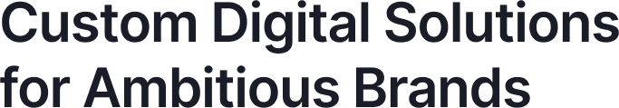
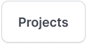
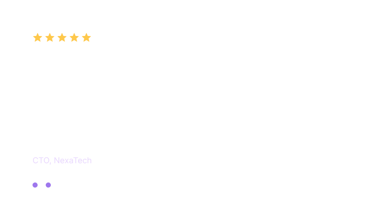
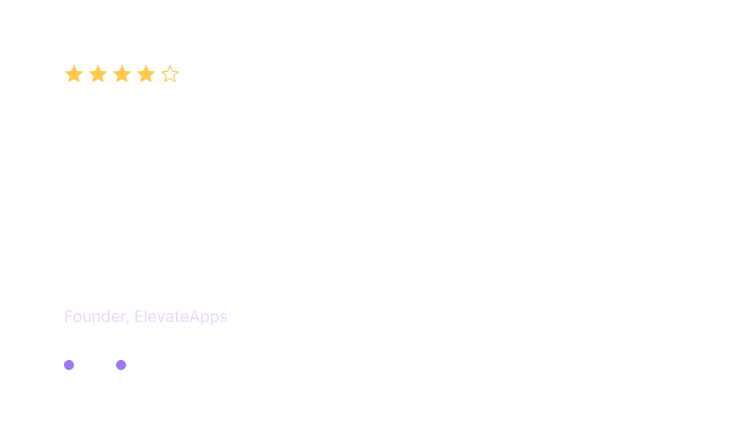

# landing-m1

<main>
     <!--Hello-->
    <nav id="Hero">
      <section class="leftInfo">
        <h1 title="title">
          
          

            
          

          <h1>
            <button title="Contact">
              
            </button>
            <button title="Projects">
              
            </button>
          </h1>
        </h1>
    </section>
    <section class="rightImage">
      
    </section>
    </nav>
    <!--Features-->
    <nav id="Feature">
      
    </nav>
    <!--Slider-->
    <nav id="slider">
      <nav id="sliderInfo">
          
          
      </nav>
      <nav id="sliderImage">
        
        
      </nav>
    </nav>
  </main>

  
into exceptional digital experiences

   <section id="right-test">
        
        
        
      </section>

      <section id="slider-heading">
                  
                  <h2 class="slider-title">
                  Reliable, efficient, and creative. The best experience we`re had with a development team.
                </h2>
                <h1 class="slider-desc">-- Daniel Foster</h1>
                
Founder, ElevateApps

                </section>

                  <!--
                  <section id="slider-heading">
                    
                    <h2 class="slider-title">
                    Reliable, efficient, and creative. The best experience we`re had with a development team.
                  </h2>
                  <h1 class="slider-desc">-- Daniel Foster</h1>
                  
Founder, ElevateApps

                  </section>

                  <section id="slider-heading">
                    
                    <h2 class="slider-title">
                    Incredible attention to detail and professionalism.
                    Our website turned out better than we imagined!
                  </h2>
                  <h1 class="slider-desc">- Hanna Saito</h1>
                  
Marketing Director, BrightWave

                  </section>

                  <section id="slider-heading">
                    
                    <h2 class="slider-title">
                    Seamless process and outstanding results! The team exceeded expectations at every day!
                  </h2>
                  <h1 class="slider-desc">-- Aoife Gallagher</h1>
                  
CTO, NexaTech

                  </section>
                  -->